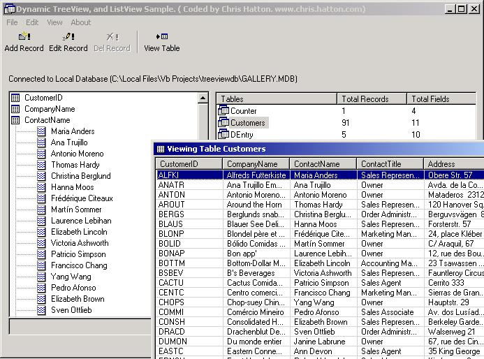



## Dynamically Populate a Treeview/Listview from MSAccess DB using ADO

### Description

This project demonstrates populating a Microsoft Access database dynamically into a treeview and listview control, by using loops and arrays. Also added the common Add/Edit/Update functions into the database for those who wish to learn the basics functions of ADO. Another purpose of designing the code the way I have with objects is so you can reuse the listview and treeview modules just in case you wanted to load the same information into another treeview or listview control, with out adding extra code. Once any database is loaded you can also edit the values in the treeview with the label edit functions. (F2). anyway there are lots of code samples available in this project.

if you like this code please vote. Thanks.
 
### More Info
 

             |
---                |---
**Submitted On**   |2002-05-01 23:34:30
**By**             |[Chris Hatton](https://github.com/Planet-Source-Code/PSCIndex/blob/master/ByAuthor/chris-hatton.md)
**Level**          |Advanced
**User Rating**    |4.9 (112 globes from 23 users)
**Compatibility**  |VB 5\.0, VB 6\.0
**Category**       |[Databases/ Data Access/ DAO/ ADO](https://github.com/Planet-Source-Code/PSCIndex/blob/master/ByCategory/databases-data-access-dao-ado__1-6.md)
**World**          |[Visual Basic](https://github.com/Planet-Source-Code/PSCIndex/blob/master/ByWorld/visual-basic.md)
**Archive File**   |[Dynamicall78227512002\.zip](https://github.com/Planet-Source-Code/chris-hatton-dynamically-populate-a-treeview-listview-from-msaccess-db-using-ado__1-34302/archive/master.zip)

